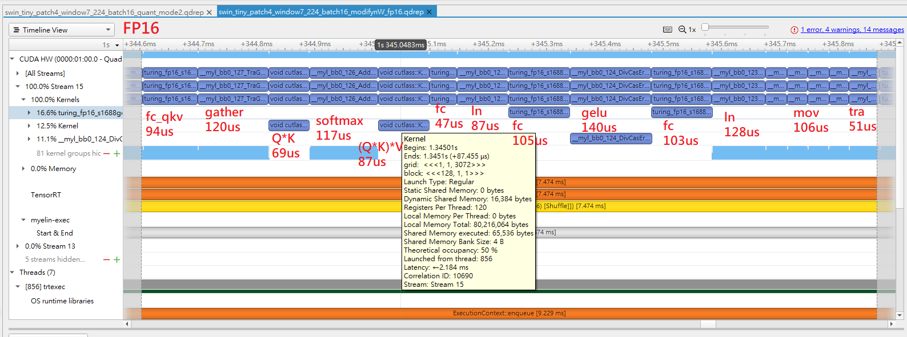
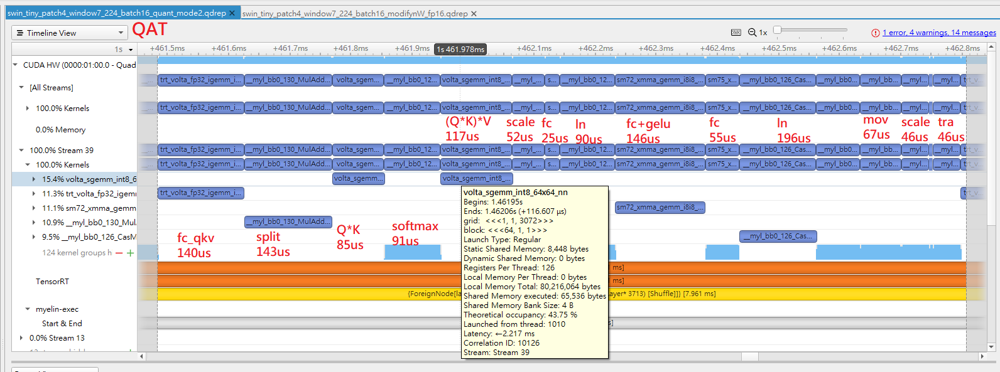

# Swin Transformer

This project aims to explore the deployment of SwinTransformer based on TensorRT, including the test results of FP16 and INT8. 

## Introduction(Quoted from the Original Project )

**Swin Transformer** [original github repo](https://github.com/microsoft/Swin-Transformer/) (the name `Swin` stands for **S**hifted **win**dow) is initially described in [arxiv](https://arxiv.org/abs/2103.14030), which capably serves as a
general-purpose backbone for computer vision. It is basically a hierarchical Transformer whose representation is
computed with shifted windows. The shifted windowing scheme brings greater efficiency by limiting self-attention
computation to non-overlapping local windows while also allowing for cross-window connection.

## Setup ##

1. Please refer to the [Data preparation](https://github.com/microsoft/Swin-Transformer/blob/main/get_started.md#data-preparation) session to prepare Imagenet-1K.

2. Actually two environments are used to do this work.  

    a). Conda environment, please refer to the [Install](https://github.com/microsoft/Swin-Transformer/blob/main/get_started.md#install) session for detail. 
    With this environment, we can run `main.py` to evaluate the accuracy of the PyTorch model, and the `export.py` script can be executed to get the onnx model.     
    
    b). TensorRT docker(from NGC, nvcr.io/nvidia/tensorrt:21.12-py3, TensorRT 8.2.1.8 is pre-installed in the docker) is mainly used to build TRT engine, run trtexec benchmark, and evaluate the accuracy of TRT engine. 
    The following utils are installed in this docker (it seems torch1.7.1 can be installed on cuda11.5):
    ```
    pip install torch==1.7.1 torchvision==0.8.2
    pip install opencv-python==4.4.0.46 termcolor==1.1.0 yacs==0.1.8
    pip install timm==0.3.2
    pip install tqdm prettytable scipy
    pip install absl-py -i http://pypi.douban.com/simple/ --trusted-host pypi.douban.com
    ```


## Code Structure ##  
Focus on the modifications and additions.
```
.
├── config.py                  # Add the default config of quantization and onnx export
├── export.py                  # Export the PyTorch model to ONNX format
├── get_started.md            
├── main.py
├── models
│   ├── build.py
│   ├── __init__.py
│   ├── swin_mlp.py
│   └── swin_transformer.py    # Build the model and add the quantization operations, modified to export the onnx and build the TensorRT engine
├── pytorch_quantization       # the source code of pytorch quantization sdk, cloned from TensorRT OSS/tools
├── README.md
├── trt                        # Directory for TensorRT's engine evaluation and visualization.
│   ├── debug                  # Compare scripts with polygraphy, compare the results of onnx and TRT engine with fixed input
│   ├── build_engine.py        # Script for engine build
│   ├── engine.py
│   ├── eval_trt.py            # Evaluate the tensorRT engine's accuary.
│   ├── eval_onnxrt.py         # Run the onnx model, generate the results, just for debugging
├── swin_quant_flow.py         # QAT workflow for swin_transformer, we haven't try the swin_mlp structure
├── utils.py
└── weights
```

## Export to ONNX and Build TensorRT Engine ##
You need to pay attention to the two modification below.  
1. Exporting the operator roll to ONNX opset version 9 is not supported.   
   A: Please refer to [torch/onnx/symbolic_opset9.py](torch/onnx/symbolic_opset9.py), add the support of exporting torch.roll.
   
2. Node (Concat_264) Op (Concat) [ShapeInferenceError] All inputs to Concat must have same rank.  
   A: Please refer to the modifications in `models/swin_transformer.py`. We use the input_resolution and window_size to compute the nW.
   ```css
      if mask is not None:
        nW = int(self.input_resolution[0]*self.input_resolution[1]/self.window_size[0]/self.window_size[1])
        #nW = mask.shape[0]
        #print('nW: ', nW)
        attn = attn.view(B_ // nW, nW, self.num_heads, N, N) + mask.unsqueeze(1).unsqueeze(0)
        attn = attn.view(-1, self.num_heads, N, N)
        attn = self.softmax(attn)
    ```


## Accuray Test Results on ImageNet-1K Validation Dataset ##  
1. Download the `Swin-T` pretrained model from [Model Zoo](https://github.com/microsoft/Swin-Transformer/blob/main/get_started.md#regular-imagenet-1k-trained-models). 
Evaluate the accuracy of the Pytorch pretrained model.
    ```bash
    $ python -m torch.distributed.launch --nproc_per_node 1 --master_port 12345 main.py --eval --cfg configs/swin_tiny_patch4_window7_224.yaml --resume ./weights/swin_tiny_patch4_window7_224.pth --data-path ../imagenet_1k
    ```

2.  `export.py` exports a pytorch model to onnx format.
    ```bash
    $ python export.py --eval --cfg configs/swin_tiny_patch4_window7_224.yaml --resume ./weights/swin_tiny_patch4_window7_224.pth --data-path ../imagenet_1k  --batch-size-onnx 32
    ```
    
3. Build the TensorRT engine using `trtexec`.  
    ```bash
    $ trtexec --onnx=./weights/swin_tiny_patch4_window7_224.onnx --buildOnly --verbose --saveEngine=./weights/swin_tiny_patch4_window7_224_batch16.engine --workspace=4096
    ```  
   
   For fp16 mode, fp16 can't store very large and very small numbers like fp32. So we need to set some specific layers to fp32 during the engine build. 
   Submitted a nvbug for the FP16 accuracy issue, please refer to [nvbug 3464358](https://nvbugswb.nvidia.com/NVBugs5/redir.aspx?url=/3464358).
   Before the bug is fixed, we can fallback the `POW` and `REDUCE` layers to FP32, it is enough to fix the accuracy problem and don't hurt the perfomance/throughput.  
   ```bash
   $ python trt/build_engine.py --onnx-file ./weights/swin_tiny_patch4_window7_224.onnx --trt-engine  ./weights/swin_tiny_patch4_window7_224_batch16_fp16.engine --verbose --mode fp16
   ```  
   
   You can use the `trtexec` to test the throughput of the TensorRT engine.
   ```bash
   $ trtexec --loadEngine=./weights/swin_tiny_patch4_window7_224_batch16.engine
   ``` 

4.  `trt/eval_trt.py` aims to evalute the accuracy of the TensorRT engine.   
    ```bash
    $ python trt/eval_trt.py --eval --cfg configs/swin_tiny_patch4_window7_224.yaml --resume ./weights/swin_tiny_patch4_window7_224_batch16.engine --data-path ../imagenet_1k --batch-size 16
    ```  

5. `trt/eval_onnxrt.py` aims to evalute the accuracy of the Onnx model, just for debug.
   ```bash
   $ python trt/eval_onnxrt.py --eval --cfg configs/swin_tiny_patch4_window7_224.yaml --resume ./weights/swin_tiny_patch4_window7_224.onnx --data-path ../imagenet_1k --batch-size 16
   ```  

## Accuracy Test of TensorRT engine (T4, TensorRT 8.2.1.8) ##
  
| SwinTransformer(T4) | Acc@1 | Notes |
| :---: | :---: | :---: |
| PyTorch Pretrained Model |  81.160 |  |
| TensorRT Engine(FP32) | 81.156 |  |
| TensorRT Engine(FP16) | 81.150 | With `POW` and `REDUCE` layers fallback to FP32 |
| TensorRT Engine(INT8 QAT) | - | Finetune for 1 epoch, got 79.980, need to improve the int8 throughput first |


## Speed Test of TensorRT engine (T4, TensorRT 8.2.1.8) ##

| SwinTransformer(T4) | FP32 | FP16 | Explicit Quantization(INT8, QAT) |
| :---: | :---: | :---: | :---: |
| batchsize=1 | 245.388 qps | 510.072 qps | 385.454 qps |
| batchsize=16 | 316.8624 qps | 804.112 qps | 815.606 qps |
| batchsize=64 | 329.13984 qps | 833.4208 qps | 780.006 qps |
| batchsize=256 | 331.9808 qps | 844.10752 qps | - |

Result:   
1. Now the accuracy and speedup of FP16 is as expected, it is highly recommended to deploy Swin-Transformer with FP16 precision.
 
2. Compared with FP16, INT8 does not speed up at present. Attached the nsys analysis file.  
   
  
  
a. For the torch.matmul operation (Q*K and (Q*K)*V) of MHA, although we insert FakeQuantize node 
before torch.matmul, `volta_sgemm_int8_64x64_nn` is choosed.  

b. Although the nn.Linear operation of Q, K and V runs with int8 precision(`trt_volta_fp32_igemm_int8_128x128_ldg4_relu_nn_v0`), 
but tensor core kernel is not enables.

The comparasion of FP16 and QAT-int8 is as below.  
   
  
 

Analysis:   
a. That SGEMM kernel is used for the two batch-GEMM: Q*K^T and (Q*K^T)*V. The gemm size is very bad for IMMA: 
(1024x3x49x32 * 1024x3x32x49 -> 1024x3x49x49) and (1024x3x49x49 * 1024x3x49x32 -> 1024x3x49x32). 
"49" is just not a good number for IMMA, while 49 equals window_size(7)*window_size(7), is widely used in Swin-Transformer. 
Please refer to [ViT and Swin-Transformer](./images/Swin_Transformer_and_ViT.pdf) for detail. 

b. QAT+FP16 is gray area. Under QAT, sometimes TRT doesn't attempt to select an fp16 gemm kernel. Therefore, our int8 engine 
may not perform as well as fp16.

Attached the fp16 engine layer information with batchsize=128 on T4.  
```css
[12/04/2021-06:44:31] [V] [TRT] Engine Layer Information:
Layer(Reformat): Reformatting CopyNode for Input Tensor 0 to Conv_0, Tactic: 0, input_0[Float(128,3,224,224)] -> Reformatted Input Tensor 0 to Conv_0[Half(128,3,224,224)]
Layer(CaskConvolution): Conv_0, Tactic: 1579845938601132607, Reformatted Input Tensor 0 to Conv_0[Half(128,3,224,224)] -> 191[Half(128,96,56,56)]
Layer(Myelin): {ForeignNode[318...(Unnamed Layer* 4183) [Shuffle]]}, Tactic: 0, 191[Half(128,96,56,56)] -> Reformatted Output Tensor 0 to {ForeignNode[318...(Unnamed Layer* 4183) [Shuffle]]}[Half(128,1000)]
Layer(Reformat): Reformatting CopyNode for Output Tensor 0 to {ForeignNode[318...(Unnamed Layer* 4183) [Shuffle]]}, Tactic: 0, Reformatted Output Tensor 0 to {ForeignNode[318...(Unnamed Layer* 4183) [Shuffle]]}[Half(128,1000)] -> output_0[Float(128,1000)]
```   

## Add Quantizer and Wrap the Fake-Quantized Model (Experiment) ##
The main modifications of `models/swin_transformer.py` are as below.  
1. For `PatchMerging` block, modify `torch.nn.Liner` to `quant_nn.QuantLinear`.  
 
2. For `WindowAttention` block,   
   a) For query, key and value, modify `torch.nn.Liner` to `quant_nn.QuantLinear`.  
   b) Quantize the four inputs of `torch.matmul`.  
   
3. For `MLP` block, modify `torch.nn.Liner` to `quant_nn.QuantLinear`.  
   
4. For `SwinTransformerBlock` block, quantize the inputs of operator `+`.


## QAT for Swin Transformer (Experiment) ##  
In order to do the QAT finetuning, some utils are needed to install.  
`tqdm`, `prettytable`, `scipy`, `absl-py`  

1. With `swin_quant_flow.py`, wrap a fake-quantized model, calibrate, QAT finetuning and export to onnx model.
   ```bash
   $ python -m torch.distributed.launch --nproc_per_node 1 --master_port 12345 swin_quant_flow.py --cfg configs/swin_tiny_patch4_window7_224.yaml --resume ./weights/swin_tiny_patch4_window7_224.pth --batch-size 64 --data-path ../imagenet_1k --quantize --num-finetune-epochs 3  --batch-size-onnx 16
   ```  

2. Build the TensorRT engine using `trt/build_engine.py`. 
   ```bash
   $ python trt/build_engine.py --onnx-file ./weights/swin_tiny_patch4_window7_224.onnx --trt-engine  ./weights/swin_tiny_patch4_window7_224_batch16_quant.engine --mode int8 --verbose --batch-size 16 
   ```  

3. `trt/eval_trt.py` aims to evalute the accuracy of the TensorRT engine. 
   ```bash
   $ python trt/eval_trt.py --eval --cfg configs/swin_tiny_patch4_window7_224.yaml --resume ./weights/swin_tiny_patch4_window7_224_batch16_quant.engine --data-path ../imagenet_1k --batch-size 16
   ```  

## Todo ##
1. Will follow the TensorRT int8 performance of Swin Transormer.